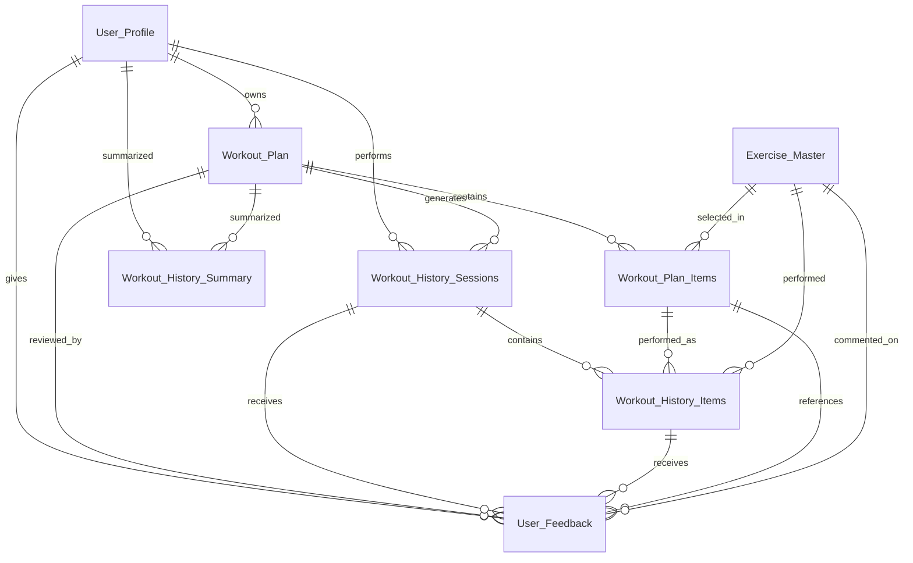

# Stage 2 Data Relationship Design

Generated at: 2026-08-12 03:38:17

## 1. Executive Summary

Stage 2 phân tích 5 master workbook và 8 bảng chính. Kết quả relationship hiện tại: **PASS**. Tất cả primary key, foreign key chính và cross-consistency rule bắt buộc đều được kiểm tra trên dữ liệu thật. Ready for Stage 3: **YES**.

## 2. Dataset Inventory

| File | Sheets | Main logical tables |
| --- | --- | --- |
| exercise_master.xlsx | gym_exercise_dataset: 350 rows, 45 cols | Exercise_Master |
| user_master.xlsx | User_Profile: 500 rows, 32 cols<br>Reference_Lists: 205 rows, 15 cols<br>Goal_Mapping: 8 rows, 3 cols<br>Data_Dictionary: 32 rows, 5 cols<br>Alignment_Notes: 6 rows, 3 cols | User_Profile |
| workout_plan_master.xlsx | Workout_Plan: 1000 rows, 27 cols<br>Workout_Plan_Items: 17634 rows, 32 cols<br>Reference_Users: 500 rows, 32 cols<br>Reference_Exercises: 350 rows, 18 cols<br>Reference_Lists: 500 rows, 13 cols<br>Data_Dictionary: 33 rows, 7 cols<br>Validation_Rules: 26 rows, 6 cols<br>Schema_Info: 18 rows, 2 cols<br>Export_Config: 8 rows, 4 cols<br>Batch_Info: 1 rows, 8 cols<br>Alignment_Notes: 13 rows, 3 cols<br>Sync_Audit: 500 rows, 9 cols<br>Quality_Summary: 6 rows, 2 cols | Workout_Plan, Workout_Plan_Items |
| workout_history_master.xlsx | Workout_History_Sessions: 18380 rows, 30 cols<br>Workout_History_Items: 80634 rows, 28 cols<br>Workout_History_Summary: 1000 rows, 18 cols<br>Source_Manifest: 3 rows, 6 cols<br>Reference_Lists: 9 rows, 3 cols<br>Data_Dictionary: 76 rows, 7 cols<br>Validation_Rules: 4 rows, 6 cols<br>Schema_Info: 8 rows, 2 cols<br>Quality_Summary: 7 rows, 3 cols<br>Alignment_Notes: 5 rows, 3 cols<br>Generation_Exceptions: 0 rows, 4 cols | Workout_History_Sessions, Workout_History_Items, Workout_History_Summary |
| user_feedback_master.xlsx | User_Feedback: 10000 rows, 28 cols<br>Reference_Lists: 23 rows, 3 cols<br>Data_Dictionary: 28 rows, 6 cols<br>Validation_Rules: 3 rows, 6 cols<br>Schema_Info: 7 rows, 2 cols<br>Quality_Summary: 13 rows, 3 cols<br>Alignment_Notes: 3 rows, 3 cols<br>Generation_Exceptions: 0 rows, 3 cols | User_Feedback |

## 3. Table / Sheet Catalog

| Table / Sheet Name | Source File | Business Meaning | Primary Key | Important Foreign Keys | Used By AI For What |
| --- | --- | --- | --- | --- | --- |
| gym_exercise_dataset | exercise_master.xlsx | Exercise reference library and safety metadata | exercise_id | - | Exercise selection, contraindication filtering, substitutions and feature metadata. |
| User_Profile | user_master.xlsx | User demographics, goals, ability, equipment and constraints | user_id | - | Personalization by goal, level, schedule, equipment, injury and preferences. |
| Workout_Plan | workout_plan_master.xlsx | Plan-level recommendation output | plan_id | user_id | Plan-level labels: split, duration, frequency, volume and progression strategy. |
| Workout_Plan_Items | workout_plan_master.xlsx | Exercise prescriptions inside each plan | plan_item_id | exercise_id, plan_id | Exercise prescription labels: order, sets, reps, RPE and rest. |
| Workout_History_Sessions | workout_history_master.xlsx | Session-level execution log | history_session_id | plan_id, user_id | Adherence, readiness, fatigue, pain and recovery signals. |
| Workout_History_Items | workout_history_master.xlsx | Exercise-level execution log | history_item_id | exercise_id, history_session_id, plan_id, plan_item_id, user_id | Exercise-level actual performance and response signals. |
| Workout_History_Summary | workout_history_master.xlsx | Representative history summary per plan | summary_id | plan_id, user_id | Compact historical representative signal per plan. |
| User_Feedback | user_feedback_master.xlsx | Explicit user preference, safety and adjustment signals | feedback_id | exercise_id, history_item_id, history_session_id, plan_id, plan_item_id, user_id | Explicit preference, difficulty, safety and requested action signals. |

## 4. Primary Key Map

| Table | Primary Key | Exists | Blank | Duplicates | Unique IDs | Status |
| --- | --- | --- | --- | --- | --- | --- |
| Exercise_Master | exercise_id | YES | 0 | 0 | 350 | PASS |
| User_Profile | user_id | YES | 0 | 0 | 500 | PASS |
| Workout_Plan | plan_id | YES | 0 | 0 | 1000 | PASS |
| Workout_Plan_Items | plan_item_id | YES | 0 | 0 | 17634 | PASS |
| Workout_History_Sessions | history_session_id | YES | 0 | 0 | 18380 | PASS |
| Workout_History_Items | history_item_id | YES | 0 | 0 | 80634 | PASS |
| Workout_History_Summary | summary_id | YES | 0 | 0 | 1000 | PASS |
| User_Feedback | feedback_id | YES | 0 | 0 | 10000 | PASS |

## 5. Foreign Key Map

| ID | Source Table | Source Column | Target Table | Target Column | Required | Checked | Blank | Missing | Status |
| --- | --- | --- | --- | --- | --- | --- | --- | --- | --- |
| REL_001 | Workout_Plan | user_id | User_Profile | user_id | YES | 1000 | 0 | 0 | PASS |
| REL_002 | Workout_Plan_Items | plan_id | Workout_Plan | plan_id | YES | 17634 | 0 | 0 | PASS |
| REL_003 | Workout_Plan_Items | exercise_id | Exercise_Master | exercise_id | YES | 17634 | 0 | 0 | PASS |
| REL_004 | Workout_History_Sessions | user_id | User_Profile | user_id | YES | 18380 | 0 | 0 | PASS |
| REL_005 | Workout_History_Sessions | plan_id | Workout_Plan | plan_id | YES | 18380 | 0 | 0 | PASS |
| REL_006 | Workout_History_Items | history_session_id | Workout_History_Sessions | history_session_id | YES | 80634 | 0 | 0 | PASS |
| REL_007 | Workout_History_Items | user_id | User_Profile | user_id | YES | 80634 | 0 | 0 | PASS |
| REL_008 | Workout_History_Items | plan_id | Workout_Plan | plan_id | YES | 80634 | 0 | 0 | PASS |
| REL_009 | Workout_History_Items | plan_item_id | Workout_Plan_Items | plan_item_id | YES | 80634 | 0 | 0 | PASS |
| REL_010 | Workout_History_Items | exercise_id | Exercise_Master | exercise_id | YES | 80634 | 0 | 0 | PASS |
| REL_011 | Workout_History_Summary | user_id | User_Profile | user_id | YES | 1000 | 0 | 0 | PASS |
| REL_012 | Workout_History_Summary | plan_id | Workout_Plan | plan_id | YES | 1000 | 0 | 0 | PASS |
| REL_013 | User_Feedback | user_id | User_Profile | user_id | YES | 10000 | 0 | 0 | PASS |
| REL_014 | User_Feedback | plan_id | Workout_Plan | plan_id | Optional when not blank | 9800 | 200 | 0 | PASS |
| REL_015 | User_Feedback | history_session_id | Workout_History_Sessions | history_session_id | Optional when not blank | 9000 | 1000 | 0 | PASS |
| REL_016 | User_Feedback | history_item_id | Workout_History_Items | history_item_id | Optional when not blank | 6000 | 4000 | 0 | PASS |
| REL_017 | User_Feedback | plan_item_id | Workout_Plan_Items | plan_item_id | Optional when not blank | 6000 | 4000 | 0 | PASS |
| REL_018 | User_Feedback | exercise_id | Exercise_Master | exercise_id | Optional when not blank | 6000 | 4000 | 0 | PASS |

## 6. Relationship Matrix

File phụ đã tạo: `docs/relationship_matrix.xlsx`. Tóm tắt relationship chính:

| Relationship ID | Source | Target | Type | Business Meaning | Validation | Status |
| --- | --- | --- | --- | --- | --- | --- |
| REL_001 | Workout_Plan.user_id | User_Profile.user_id | N:1 | Every workout plan belongs to one existing user. | ERROR if missing | PASS |
| REL_002 | Workout_Plan_Items.plan_id | Workout_Plan.plan_id | N:1 | Every plan item belongs to one existing plan. | ERROR if missing | PASS |
| REL_003 | Workout_Plan_Items.exercise_id | Exercise_Master.exercise_id | N:1 | Every planned exercise must exist in the exercise library. | ERROR if missing | PASS |
| REL_004 | Workout_History_Sessions.user_id | User_Profile.user_id | N:1 | Every history session belongs to one existing user. | ERROR if missing | PASS |
| REL_005 | Workout_History_Sessions.plan_id | Workout_Plan.plan_id | N:1 | Every history session is generated from one existing plan. | ERROR if missing | PASS |
| REL_006 | Workout_History_Items.history_session_id | Workout_History_Sessions.history_session_id | N:1 | Every history item belongs to one existing session. | ERROR if missing | PASS |
| REL_007 | Workout_History_Items.user_id | User_Profile.user_id | N:1 | Every history item keeps user context. | ERROR if missing | PASS |
| REL_008 | Workout_History_Items.plan_id | Workout_Plan.plan_id | N:1 | Every history item keeps plan context. | ERROR if missing | PASS |
| REL_009 | Workout_History_Items.plan_item_id | Workout_Plan_Items.plan_item_id | N:1 | Every performed item links back to the prescribed plan item. | ERROR if missing | PASS |
| REL_010 | Workout_History_Items.exercise_id | Exercise_Master.exercise_id | N:1 | Every performed exercise must exist in the exercise library. | ERROR if missing | PASS |
| REL_011 | Workout_History_Summary.user_id | User_Profile.user_id | N:1 | Every summary belongs to an existing user. | ERROR if missing | PASS |
| REL_012 | Workout_History_Summary.plan_id | Workout_Plan.plan_id | N:1 | Every summary describes an existing plan. | ERROR if missing | PASS |
| REL_013 | User_Feedback.user_id | User_Profile.user_id | N:1 | Every feedback row belongs to an existing user. | ERROR if missing | PASS |
| REL_014 | User_Feedback.plan_id | Workout_Plan.plan_id | N:1 | Plan feedback links to a plan when scope has plan context. | ERROR if missing | PASS |
| REL_015 | User_Feedback.history_session_id | Workout_History_Sessions.history_session_id | N:1 | Session and exercise feedback link to the related session when present. | ERROR if missing | PASS |
| REL_016 | User_Feedback.history_item_id | Workout_History_Items.history_item_id | N:1 | Exercise feedback links to the exact performed item when present. | ERROR if missing | PASS |
| REL_017 | User_Feedback.plan_item_id | Workout_Plan_Items.plan_item_id | N:1 | Exercise feedback can link to the prescribed plan item when present. | ERROR if missing | PASS |
| REL_018 | User_Feedback.exercise_id | Exercise_Master.exercise_id | N:1 | Exercise feedback can link directly to the exercise library when present. | ERROR if missing | PASS |

## 7. Cardinality Analysis

| Relationship | Type | Requirement | Source Rows | Target IDs | Min Child | Avg Child | Max Child | AI Impact If Broken |
| --- | --- | --- | --- | --- | --- | --- | --- | --- |
| User_Profile 1 - N Workout_Plan | N:1 | Required | 1000 | 500 | 2 | 2.0 | 2 | Personalization context becomes invalid. |
| Workout_Plan 1 - N Workout_Plan_Items | N:1 | Required | 17634 | 1000 | 2 | 17.63 | 48 | Plan structure or exercise prescription becomes invalid. |
| Exercise_Master 1 - N Workout_Plan_Items | N:1 | Required | 17634 | 350 | 2 | 79.79 | 2114 | Plan structure or exercise prescription becomes invalid. |
| User_Profile 1 - N Workout_History_Sessions | N:1 | Required | 18380 | 500 | 32 | 36.76 | 41 | Adherence and performance labels can attach to the wrong user, plan or exercise. |
| Workout_Plan 1 - N Workout_History_Sessions | N:1 | Required | 18380 | 1000 | 16 | 18.38 | 22 | Adherence and performance labels can attach to the wrong user, plan or exercise. |
| Workout_History_Sessions 1 - N Workout_History_Items | N:1 | Required | 80634 | 18380 | 1 | 4.39 | 7 | Adherence and performance labels can attach to the wrong user, plan or exercise. |
| User_Profile 1 - N Workout_History_Items | N:1 | Required | 80634 | 500 | 32 | 161.27 | 287 | Adherence and performance labels can attach to the wrong user, plan or exercise. |
| Workout_Plan 1 - N Workout_History_Items | N:1 | Required | 80634 | 1000 | 16 | 80.63 | 154 | Adherence and performance labels can attach to the wrong user, plan or exercise. |
| Workout_Plan_Items 1 - N Workout_History_Items | N:1 | Required | 80634 | 17634 | 2 | 4.7 | 8 | Adherence and performance labels can attach to the wrong user, plan or exercise. |
| Exercise_Master 1 - N Workout_History_Items | N:1 | Required | 80634 | 350 | 5 | 366.52 | 9891 | Adherence and performance labels can attach to the wrong user, plan or exercise. |
| User_Profile 1 - N Workout_History_Summary | N:1 | Required | 1000 | 500 | 2 | 2.0 | 2 | Adherence and performance labels can attach to the wrong user, plan or exercise. |
| Workout_Plan 1 - N Workout_History_Summary | N:1 | Required | 1000 | 1000 | 1 | 1.0 | 1 | Adherence and performance labels can attach to the wrong user, plan or exercise. |
| User_Profile 1 - N User_Feedback | N:1 | Required | 10000 | 500 | 2 | 20.0 | 175 | Feedback can be assigned to wrong context, corrupting preference learning. |
| Workout_Plan 1 - N User_Feedback | N:1 | Optional FK allowed | 10000 | 1000 | 1 | 9.94 | 173 | Feedback can be assigned to wrong context, corrupting preference learning. |
| Workout_History_Sessions 1 - N User_Feedback | N:1 | Optional FK allowed | 10000 | 18380 | 1 | 2.9 | 8 | Feedback can be assigned to wrong context, corrupting preference learning. |
| Workout_History_Items 1 - N User_Feedback | N:1 | Optional FK allowed | 10000 | 80634 | 1 | 1.0 | 1 | Feedback can be assigned to wrong context, corrupting preference learning. |
| Workout_Plan_Items 1 - N User_Feedback | N:1 | Optional FK allowed | 10000 | 17634 | 1 | 3.6 | 8 | Feedback can be assigned to wrong context, corrupting preference learning. |
| Exercise_Master 1 - N User_Feedback | N:1 | Optional FK allowed | 10000 | 350 | 1 | 40.82 | 716 | Feedback can be assigned to wrong context, corrupting preference learning. |

## 8. ERD Dạng Text

```text
User_Profile (PK user_id)
  1 ── N Workout_Plan (PK plan_id, FK user_id)
          1 ── N Workout_Plan_Items (PK plan_item_id, FK plan_id, FK exercise_id)
                         N ── 1 Exercise_Master (PK exercise_id)

User_Profile (PK user_id)
  1 ── N Workout_History_Sessions (PK history_session_id, FK user_id, FK plan_id)
          1 ── N Workout_History_Items (PK history_item_id, FK history_session_id, FK user_id, FK plan_id, FK plan_item_id, FK exercise_id)
                         N ── 1 Workout_Plan_Items
                         N ── 1 Exercise_Master

Workout_History_Summary (PK summary_id)
  N ── 1 User_Profile
  N ── 1 Workout_Plan

User_Feedback (PK feedback_id)
  N ── 1 User_Profile
  N ── 1 Workout_Plan optional
  N ── 1 Workout_History_Sessions optional
  N ── 1 Workout_History_Items optional
  N ── 1 Workout_Plan_Items optional
  N ── 1 Exercise_Master optional
```

## 9. ERD Dạng Mermaid



## 10. Data Flow Tổng Thể

```text
User_Profile + Exercise_Master
    ↓
Workout_Plan
    ↓
Workout_Plan_Items
    ↓
Workout_History_Sessions
    ↓
Workout_History_Items
    ↓
User_Feedback
    ↓
Recommendation / Adjustment / AI Coach layer in later stages
```

## 11. Data Flow Theo Use Case

| Use Case | Input | Output | AI Uses |
| --- | --- | --- | --- |
| Generate Workout Plan | User_Profile, Exercise_Master | Workout_Plan, Workout_Plan_Items | goal, training_level, available_days, equipment, injury, difficulty, primary_muscles, movement_pattern, contraindications |
| Log Workout History | Workout_Plan, Workout_Plan_Items | Workout_History_Sessions, Workout_History_Items | completion, actual reps, RPE, fatigue, pain, technique, enjoyment |
| Collect User Feedback | Workout_History_Sessions, Workout_History_Items, Workout_Plan, Exercise_Master | User_Feedback | preference, difficulty feedback, pain feedback, duration feedback, requested_action |
| Adjust Next Plan | User_Profile, Workout_Plan, Workout_History, User_Feedback, Exercise_Master | Updated Workout_Plan in later stage | keep, replace, reduce volume, increase volume, review safety |
| Safety Review | injury / limitation, contraindication, pain history, pain feedback | Review Safety / Avoid / Replace / Reduce Difficulty | pain_areas, pain_feedback, recovery_flag, contraindications |
| Personalization Memory | User_Feedback, Workout_History, Exercise_Master | User preference profile in later stage | prefer/avoid exercise list, exercise preference score |

## 12. AI Data Usage Map

File phụ đã tạo: `docs/ai_data_usage_map.md`.

| Table | AI Learns |
| --- | --- |
| Exercise_Master | muscle targets, difficulty, equipment, movement pattern, risks, substitutions and goal fit |
| User_Profile | who the user is, goal, level, schedule, equipment, limitations and starting preferences |
| Workout_Plan | the recommended plan structure, split, volume, intensity and progression strategy |
| Workout_Plan_Items | which exercise appears in each session, order, sets, reps, target RPE and rest |
| Workout_History_Sessions | completion, fatigue, sleep/readiness, pain and session-level adherence |
| Workout_History_Items | actual reps/sets/RPE, technique, enjoyment, pain and exercise-level adherence |
| Workout_History_Summary | compressed plan outcome signal for fast downstream validation and modeling |
| User_Feedback | likes/dislikes, too hard/easy, pain reports, duration feedback and desired adjustment |

## 13. Relationship Validation Rules

File phụ đã tạo: `docs/relationship_validation_rules.md`. Bộ rule gồm 18 FK rules, 12 design/aggregate rules và 13 cross-consistency rules.

## 14. Cross-consistency Rules

| Rule | Description | Join | Compare | Checked | Missing Target | Mismatches | Status |
| --- | --- | --- | --- | --- | --- | --- | --- |
| CROSS_001 | History item user_id must match its session user_id. | Workout_History_Items.history_session_id -> Workout_History_Sessions | user_id == user_id | 80634 | 0 | 0 | PASS |
| CROSS_002 | History item plan_id must match its session plan_id. | Workout_History_Items.history_session_id -> Workout_History_Sessions | plan_id == plan_id | 80634 | 0 | 0 | PASS |
| CROSS_003 | History item plan_id must match its plan item plan_id. | Workout_History_Items.plan_item_id -> Workout_Plan_Items | plan_id == plan_id | 80634 | 0 | 0 | PASS |
| CROSS_004 | History item exercise_id must match its plan item exercise_id. | Workout_History_Items.plan_item_id -> Workout_Plan_Items | exercise_id == exercise_id | 80634 | 0 | 0 | PASS |
| CROSS_005 | History summary user_id must match the owning plan user_id. | Workout_History_Summary.plan_id -> Workout_Plan | user_id == user_id | 1000 | 0 | 0 | PASS |
| CROSS_006 | Feedback user_id must match the referenced history item. | User_Feedback.history_item_id -> Workout_History_Items | user_id == user_id | 6000 | 0 | 0 | PASS |
| CROSS_007 | Feedback plan_id must match the referenced history item when both are present. | User_Feedback.history_item_id -> Workout_History_Items | plan_id == plan_id | 6000 | 0 | 0 | PASS |
| CROSS_008 | Feedback plan_item_id must match the referenced history item when both are present. | User_Feedback.history_item_id -> Workout_History_Items | plan_item_id == plan_item_id | 6000 | 0 | 0 | PASS |
| CROSS_009 | Feedback exercise_id must match the referenced history item when both are present. | User_Feedback.history_item_id -> Workout_History_Items | exercise_id == exercise_id | 6000 | 0 | 0 | PASS |
| CROSS_010 | Feedback user_id must match the referenced session. | User_Feedback.history_session_id -> Workout_History_Sessions | user_id == user_id | 9000 | 0 | 0 | PASS |
| CROSS_011 | Feedback plan_id must match the referenced session when both are present. | User_Feedback.history_session_id -> Workout_History_Sessions | plan_id == plan_id | 9000 | 0 | 0 | PASS |
| CROSS_012 | Feedback plan_id must match the referenced plan item when both are present. | User_Feedback.plan_item_id -> Workout_Plan_Items | plan_id == plan_id | 6000 | 0 | 0 | PASS |
| CROSS_013 | Feedback exercise_id must match the referenced plan item when both are present. | User_Feedback.plan_item_id -> Workout_Plan_Items | exercise_id == exercise_id | 6000 | 0 | 0 | PASS |

## 15. SQL Schema Design

| Table | Primary Key | Foreign Keys | Important Indexes | Delete / Update Behavior |
| --- | --- | --- | --- | --- |
| users | user_id | - | idx_users_goal_level, idx_users_equipment | RESTRICT delete when plans/history exist |
| exercises | exercise_id | - | idx_exercises_muscle, idx_exercises_equipment, idx_exercises_difficulty | RESTRICT delete when referenced |
| workout_plans | plan_id | user_id -> users.user_id | idx_workout_plan_user_id, idx_workout_plan_goal | CASCADE update IDs; RESTRICT delete if history exists |
| workout_plan_items | plan_item_id | plan_id -> workout_plans.plan_id; exercise_id -> exercises.exercise_id | idx_plan_item_plan_id, idx_plan_item_exercise_id | CASCADE delete only with plan before history exists |
| workout_history_sessions | history_session_id | user_id -> users.user_id; plan_id -> workout_plans.plan_id | idx_history_session_user_plan, idx_history_session_date | RESTRICT user/plan deletes |
| workout_history_items | history_item_id | history_session_id, user_id, plan_id, plan_item_id, exercise_id | idx_history_item_session, idx_history_item_plan_item, idx_history_item_exercise | CASCADE delete with session only in non-production cleanup |
| workout_history_summary | summary_id | user_id -> users.user_id; plan_id -> workout_plans.plan_id | idx_history_summary_user_plan | Regenerate from history; avoid manual edits |
| user_feedback | feedback_id | user_id, plan_id, history_session_id, history_item_id, plan_item_id, exercise_id | idx_user_feedback_user, idx_user_feedback_history_item, idx_user_feedback_scope, idx_user_feedback_sentiment | RESTRICT referenced entity deletes |

## 16. MongoDB Schema Design

| Collection | Embed Strategy | Reference Strategy | Why |
| --- | --- | --- | --- |
| users | One document per user | Reference plans/history/feedback by user_id | User profile is frequently read as one unit. |
| exercises | One document per exercise | Referenced by exercise_id | Exercise metadata is shared by many plans/history rows. |
| workout_plans | Embed plan_items inside plan document; reference exercise_id | Reference user_id and exercise_id | Plan and its items are usually read together; exercise library remains normalized. |
| workout_history | One session document embedding history_items | Reference user_id, plan_id, plan_item_id, exercise_id | Session log and item log are read together for adherence analysis. |
| user_feedback | Separate collection | Reference user_id, plan_id, history_session_id, history_item_id, plan_item_id, exercise_id | Feedback is queried by scope, sentiment, action and training signal. |

Snapshot fields such as `user_id`, `plan_id`, `plan_item_id` and `exercise_id` should remain duplicated in feedback/history because they reduce joins for feature engineering and preserve context if plan definitions are later versioned.

## 17. Known Issues / Notes

| Type | Note |
| --- | --- |
| Training distribution note | Workout_History_Sessions có 1084 Skipped session, tương đương 5.898% tổng session. Validator đã được chỉnh để không cảnh báo HIS007 cho Skipped hợp lệ. |
| Non-blocking issue | openpyxl có thể in UserWarning về default style khi đọc workbook; đây không phải lỗi relationship hoặc validator dataset. |

## 18. Checklist Trước Giai Đoạn 3

- [x] Đã xác định đủ bảng chính
- [x] Đã xác định đủ primary key
- [x] Đã kiểm tra primary key không trùng
- [x] Đã xác định đủ foreign key
- [x] Đã kiểm tra FK tồn tại trong bảng đích
- [x] Đã xác định cardinality
- [x] Đã có Relationship Matrix
- [x] Đã có ERD text
- [x] Đã có Mermaid ERD
- [x] Đã có Data Flow tổng thể
- [x] Đã có Data Flow theo use case
- [x] Đã có AI Data Usage Map
- [x] Đã có Relationship Validation Rules
- [x] Đã có Cross-consistency Rules
- [x] Đã có SQL schema design
- [x] Đã có MongoDB schema design
- [x] Đã ghi Known Issues
- [x] Sẵn sàng viết validator tổng hợp ở Giai đoạn 3

## 19. Stage 2 Final Status

| Metric | Value |
| --- | --- |
| Stage 2 Status | PASS |
| Tables analyzed | 8 |
| Files analyzed | 5 |
| Primary keys found | 8 |
| Foreign keys found | 18 |
| Relationship count | 18 |
| Cross-consistency rules | 13 |
| Blocking issues | 0 |
| Non-blocking issues | 2 |
| Recommended fixes before Stage 3 | None blocking. Keep HIS007 rule excluding valid Skipped sessions. |
| Recommended fixes before AI training | None blocking. Skipped distribution is present for realistic user dropout behavior. |
| Ready for Stage 3 | YES |
